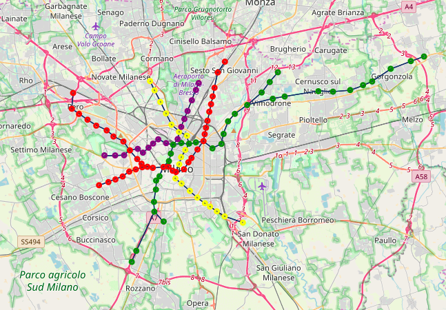
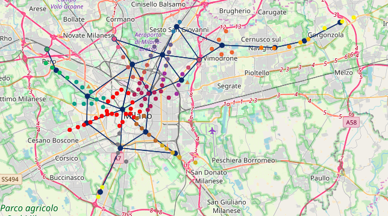
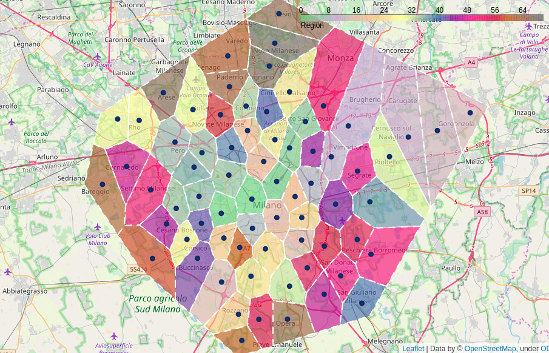
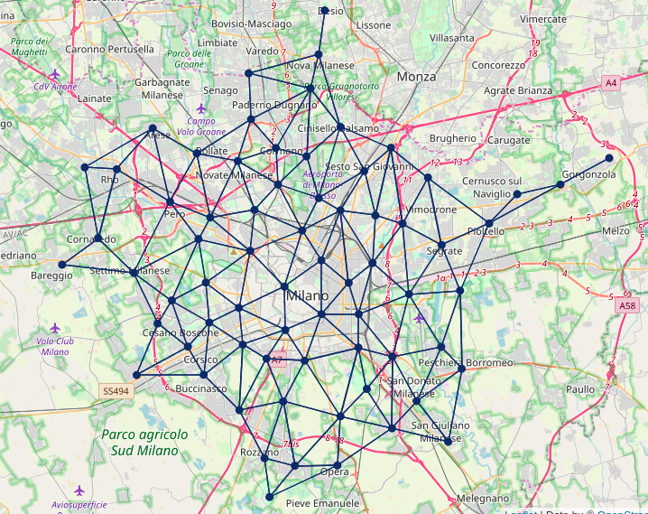
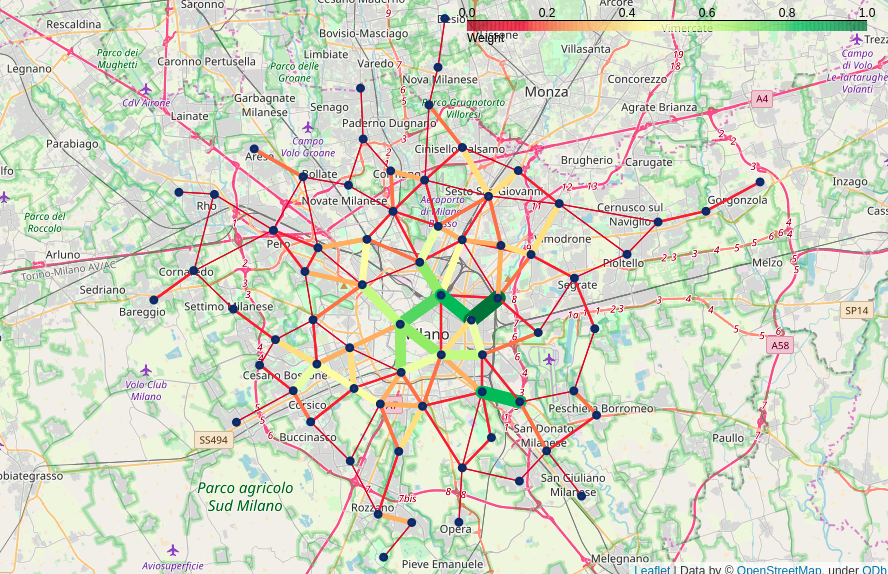

```{r setup, include=FALSE}
knitr::opts_chunk$set(echo = TRUE)
```

## Introduction

This project aims to analyze the structure of a city network using averaged graphs of the different means of public transport.

Average graphs represent the connectivity between regions in a city. Using this method allows to overcome the disjointed nature of the different networks of transport and possibly noisy datasets without having to expend significant resouces into data quality processing. 
Given different average graphs representing different types of connections (neighboring regions, transport direct connections), it is possible to analyze and compare each to understand how optimal a public transport network is.
Simulation of random failures and attacks can also shed insight on the robustness of the network.

## Project structure

The project has been developed to allow easy reusability/recomputation of the transit feed data for different times or cities. As each public transport regulator may implement the GTFS format differently, slight modifications might have to be made. 
The code provided in the project's GitHub [repository](https://github.com/dodicin/transport-network-analysis) is tested and works on Milan's Azienda Mobilità Ambiente e Territorio GTFS feed, the README containing the instructions to reproduce this work.

## Data management

All data has been obtained by [OpenMobilityData](https://transitfeeds.com/). The data consists of Milan's GTFS feed from the 4th of March 2019 to the 4th of April 2019.
As the data is quite extensive, a PostgreSQL Docker container has been setup for ease of use to contain Milan's GTFS database, with automatized database population. 

The GTFS (General Transit Feed Specification) is a collection of at least 6 and up to 13 CSV files, describing a transit system's scheduled operations. The necessary data to reconstruct a network is contained in the following tables:

* **Stops**: Defines stops where vehicles pick up or drop off riders.
* **Stop times**: Provides the times when a vehicle arrives at and departs from individual stops for each trip.
* **Trips**: Defines trips for each route. A trip is a sequence of two or more stops that occur during a specific time period.
* **Route**: Defines transit routes. A route is a group of trips that are displayed to riders as a single service.

Through a set of different queries and some data processing, tables containing every stop for every route for metro lines, buses and trams have been produced.

Following are some statistics for the resulting graphs:

* **Metro**:
  * Density: 0.02
  * Nodes: 106
  * Edges: 109
  
* **Bus**:
  * Density: 0.001
  * Nodes: 2110
  * Edges: 2163
  
* **Tram**:
  * Density: 0.004
  * Nodes: 449
  * Edges: 445

## Data analytics methodology

The graphs of metro lines, buses and trams are disjoint: although different stops refer to the same street, they are located at different coordinates and have a different unique IDs. As such, metro stations, bus stops and tram stops never intersecate, although there are some exceptions for buses and trams sharing the same stop (same unique ID).

It's not sensible to conduct a network analysis and failure test on a disjointed network: although not directly connected, people can and will move from a metro station to its nearest bus or tram station, to move from point A to point B. In case of failures between stops, spatially close stops work as a back-off to allow paths A and B, with C failed, to be reached by a working stop D.

Graphs derived from large transit systems networks and how to represent mobility has been extensively studied. An approach to represent trajectory data of city-wide traffic dynamics in spatial and temporal domains has been proposed by @inproceedings. An approach building on the previous, by @multilayertraffic, analyzes different traffic flows on a shared spatial grid, allowing for multiple traffic flows to be analyzed as a real world network.

This project takes inspiration from both these approaches to analyze how Milan's transport network behaves in the spatial domain.

## Neighbor graph
### Partitioning a network in cells

The partitioning of a network in regions (hereon cells) according to the spatial relation of its nodes (the stops in this case) is based on a method developed by @spgen.

Let $S$ be a set of seed points, where a point $p(lat, lon)$ represent a stop. Let $\gamma$ be the radius specifying the radius of a cell. We'll have: 

$$
\small
\forall p_n \in S 
\begin{cases} 
  p_n \in C_i.m,C_i.c = avg(C_i.m) &: dist(p, C_i.c) < \gamma\\
  p_n \in C_{i+1}.m,  C_{i+1}.c = p_n &: otherwise
\end{cases}
\normalsize
$$

Where $C_i$ in the presentated formula is a cell of points each inside the radius of the cell's centroid, $C_i.m$ represents the cell's members and $C_i.c$ is the cell's centroid. The centroid of each cell is estimated iteratively by finding the mean of each point as they get assigned to each cell. 
After all the points $p$ have been grouped into cells $G_i$, the cells are emptied and the points redistributed to the closest cell.

The set of cells $C$ represents the partitions into which the stops are grouped. 


 



From $C$, it is possible to compute the Voronoi diagram of $C$, which partitions the space into geometrical cells with $C_i.centroid$ as a center, delineating the boundaries between each cell Its complementary graph, computed through the Delaunay triangulation of the centroids, represents the *graph of neighboring regions* (hereon neighbor graph), while the Voronoi diagram represents the *spatial subdivision of the area*.
Since boundary regions can be neighbor to other distant regions through to-infinity borders (i.e. Voronoi Diagrams aren't bounded per se), a parameter $\rho$ is given as a neighboring distance limit. The value chosen for this network is $\rho = 5km$.

The neighbor graph represents the spatial connections between regions of a city. While connected spatially, neighboring regions might not be served by public transport. To obtain a graph representing the actual transit connections between regions of a city, we'll check the cell-to-cell flow between regions.


## Cell-to-cell flow graph

The cell-to-cell flow takes into account the number of effective *direct links* between the single stops inside the regions. While the node of each regions remains the same, the edges vary according to the number of direct between the stops in the regions. Two regions having many stops directly connected between them will have a higher weight to their edges, and the opposite holds true as well. Two neighboring regions not connected by a direct link of their stops will not be connected in the cell-to-cell graph.

The cell-to-cell flow graph represent the actual connections served by the public transport.


## Network Analytics

Analyzing the difference between the neighbor graph and the cell-to-cell graph can give interesting insights into how well-connected are different city regions and how resilient each connection is. Centrality measures can help measuring these differences by computing the importance of a node in the graph according to different parameters. Some of the measures used are explained below:

The degree centrality represent the strength of the connection of a node to the network - lower degree regions might cause more inconveniences to the passengers were any of the stops to fail or close.
$$
C_D(G) = \frac{\sum_{i=1}^{|V|}[deg(v*)-deg(v_i)]}{|V|^2 - 3|V|+2}
$$
The closeness centrality represent how much a node can influence other nodes, or spread information, in the network. Highly connected networks tend to have similar closeness for every node. For transit systems this represents a measure of how much a node can offer access to other nodes and spread passengers quickly to any destination of the network.
$$
C_C(G) = \frac{1}{\sum_{x \in V}l(x, y)}
$$
The betweenness centrality represent how much a node has influence over flows in a graph. For transit systems this is a measure of how much a region acts as a bridge between different clusters of regions in the graph.
$$
C_B(G) = \sum_{s\neq v \neq t \in V}\frac{\sigma_{st}(v)}{\sigma_{st}}
$$








## Resilience to attacks and failures

In the resilience analysis we consider how the cell-to-cell flow graph reacts to different attack strategy. Clearly, this won't give a detailed insight into how each single stop reacts to failure, being an averaged graph, but on other hand, it allows us to observe how **area of effect** attack might influence the network. Such attacks might be, terrorist attacks or natural disasters, influencing a region with a radius $\gamma$. Moreover, being the $\gamma$ a simple parameter, it's possible to play with it to make it fit different scenarios - it is possible to create microregions that roughly represent a single stop, although we suggest to select a $\gamma$ value that's more than the minimum distance between two stops in the network, to avoid keeping disjointed routes.

The origin and scenario of an attack or cascading failures may vary wildly. It can be due to an eccessive load of the network, or be topological in nature (a node, or stop, becomes inaccessible, cutting the link between other nodes). We chose to inspect the second type of attacks, analyzing different strategies that go from random nodes elimination to eliminating nodes with the highest centrality of a certain kind.

* **Random vertex** (RV): vertices are removed in random order
* **Random neighbor** (RN): one by one, a random neighbor of a random node is removed, until the node has no neighbors
* **Degree** ($C_D$): vertices are removed in the graph according to their highest degree, recomputed after every elimination
* **Initial degree** ($C_{Di}$): vertices are removed in the graph according to their highest degree, computed once at the beginning
* **Closeness** ($C_{D}$): vertices are removed in the graph according to their highest closeness, recomputed after every elimination
* **Initial closeness** ($C_{Ci}$): vertices are removed in the graph according to their highest closeness, computed once at the beginning
* **Betweenness** ($C_{B}$): vertices are removed in the graph according to their highest betweenness, recomputed after every elimination
* **Initial betweenness** ($C_{Bi}$): vertices are removed in the graph according to their highest betweenness, computed once at the beginning
* **Clustering coefficient** ($C_{C}$): vertices are removed in the graph according to their highest clustering coefficient, recomputed after every elimination
* **Initial clustering coefficient** ($C_{CLi}$): vertices are removed in the graph according to their highest clustering coefficient, computed once at the beginning
* **Eigenvalue** ($C_{E}$): vertices are removed in the graph according to their highest eigenvalue, recomputed after every elimination
* **Initial eigenvalue** ($C_{Ei}$): vertices are removed in the graph according to their highest eigenvalue, computed once at the beginning
* **PageRank** ($C_{P}$): vertices are removed in the graph according to their highest pagerank, recomputed after every elimination
* **Initial PageRank** ($C_{Pi}$): vertices are removed in the graph according to their highest pagerank, computed once at the beginning


## Results

The results are measured by assessing the size of the giant connected component GCC, representing the largest connected component of a given network.
The measure of the GCC will be called $S$, and be such that:
$$
S = \frac{N_{GCC}}{N}*100
$$
Where $N_{GCC}$ is the number of vertices in the GCC and $N$ is the number of nodes in the graph.

\pagebreak

## References
